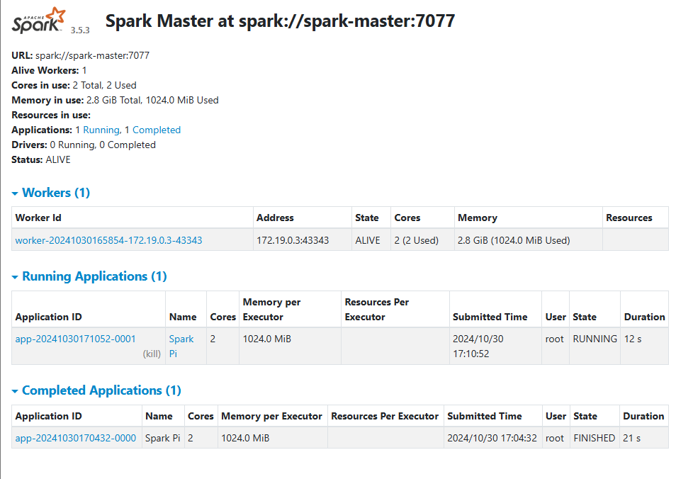
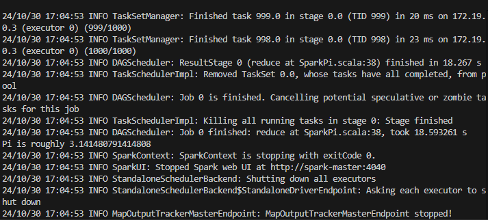

# Spark using Docker
## Option 1: Running Spark Services as follows using Docker Compose
Run the services as follows using docker compose: `docker compose up --build -d`

### Output:




## Option 2: Run the Servics Separately using Docker
```bash
# Create the image from the Docker file as follows:
docker build -t workshop/spark:latest .
# Create a network
docker network create spark-network
# Start the master container
docker run --rm -it --name spark-master --network spark-network -p 8080:8080 -p 7077:7077 -e "SPARK_LOCAL_IP=spark-master" -e "SPARK_MASTER_PORT=7077" -e "SPARK_MASTER_WEBUI_PORT=8080" workshop/spark:latest /bin/sh
# Once inside this container start the spark master as follows:
./start-master.sh
# In another terminal start the worker container
docker run --rm -it --name spark-worker --network spark-network -p 8081:8081 -e "SPARK_MASTER=spark://spark-master:7077" -e "SPARK_WORKER_WEBUI_PORT=8081" workshop/spark:latest /bin/sh
# Once inside this container start the spark worker as follows:
./start-worker.sh

# Spark Job Option 1
# Start the spark job by running the following command in a new terminal
# This will execute the command in the spark-master container
docker exec -it spark-master /bin/sh -c "/spark/bin/spark-submit --master spark://spark-master:7077 --class org.apache.spark.examples.SparkPi  /spark/examples/jars/spark-examples_2.12-3.5.3.jar 1000"

# Spark Job Option 2: The JavaWordCount example reads the text file and counts the occurrences of each word.
# execute in a new terminal
# enter the container
docker exec -it spark-master /bin/sh
# create a text file
echo "Hello World Hello" > /spark/examples/src/main/resources/test.txt
# submit a spark job
/spark/bin/spark-submit --master spark://spark-master:7077 --class org.apache.spark.examples.Java
WordCount /spark/examples/jars/spark-examples_2.12-3.5.3.jar /spark/examples/src/main/resources/test.txt
```